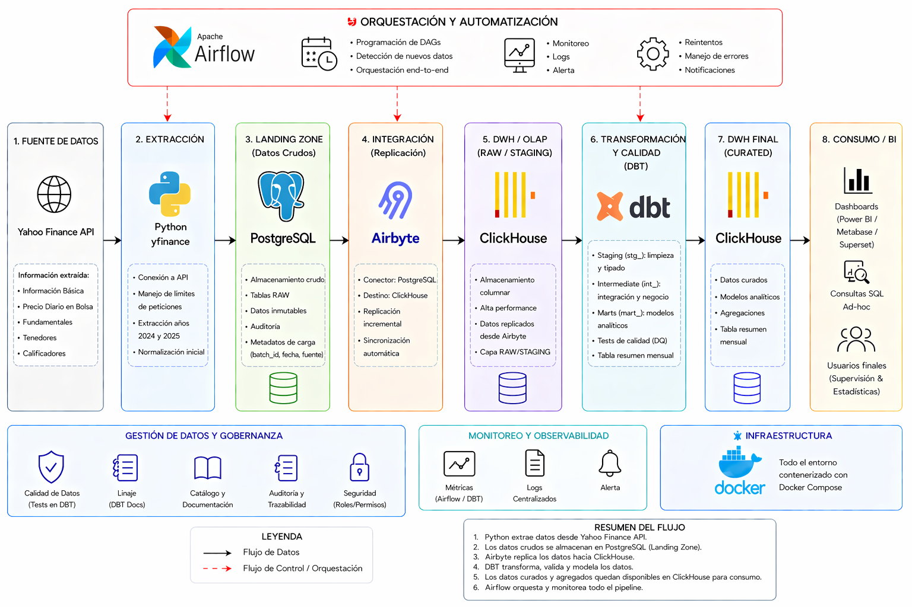

# Data Pipeline End-to-End


## Overview

Este proyecto implementa un pipeline de datos end-to-end para ingestar, replicar, transformar y validar información financiera en una arquitectura moderna de datos, completamente containerizada con Docker.

Flujo principal:

`Yahoo Finance API → PostgreSQL (raw/landing) → Airbyte (EL) → ClickHouse (DWH) → dbt (staging + marts) → Data Mart`

---

## Arquitectura



---

## Stack Tecnologico

- Docker y Docker Compose
- PostgreSQL 15 (landing zone)
- ClickHouse 23 (data warehouse)
- Airbyte (replicacion EL)
- dbt (transformaciones y pruebas)
- Apache Airflow 2.8.1 (orquestacion)
- Python (ingestion)

---

## Estructura del Proyecto

```text
.
├── airflow/
│   └── dags/
│       └── pipeline_dag.py
├── dbt_clickhouse/
│   ├── models/
│   │   ├── staging/
│   │   └── marts/
│   ├── dbt_project.yml
│   └── profiles.yml
├── infrastructure/
│   └── postgres/
│       └── init.sql
├── ingestion_service/
│   ├── Dockerfile
│   └── requirements.txt
├── src/ingestion/
│   ├── extract.py
│   ├── transform.py
│   ├── load.py
│   └── main.py
├── diagrama_arquitectura1.png
├── docker-compose.yml
└── README.md
```

---

## Variables de Entorno

Por seguridad, no se versiona `.env`. Usa `.env.example` como plantilla:

```bash
cp .env.example .env
```

Contenido esperado:

```env
POSTGRES_USER=your_user
POSTGRES_PASSWORD=your_password
POSTGRES_DB=landing_db
POSTGRES_PORT=5432

CLICKHOUSE_DB=dwh
CLICKHOUSE_USER=default
CLICKHOUSE_PASSWORD=password
CLICKHOUSE_PORT=8123

AIRBYTE_EMAIL=your_email
AIRBYTE_PASSWORD=your_password
```

---

## Ejecucion del Proyecto

### 1. Clonar repositorio

```bash
git clone https://github.com/TU_USUARIO/data-pipeline-e2e.git
cd data-pipeline-e2e
```

### 2. Configurar variables

```bash
cp .env.example .env
```

Edita `.env` con tus credenciales.

### 3. Levantar servicios

```bash
docker compose up -d
```

### 4. Verificar estado

```bash
docker compose ps
```

---

## Accesos

- Airflow UI: `http://localhost:8081`
- ClickHouse HTTP: `http://localhost:8123`
- Airbyte UI: `http://localhost:8000` (si lo tienes corriendo en tu entorno)

---

## 🔹 Instalacion de Airbyte (abctl)

Este proyecto utiliza Airbyte en local mediante `abctl` (Airbyte CLI), lo que permite levantar la infraestructura completa sin depender de servicios SaaS.

> ⚠️ Airbyte **no esta incluido en `docker-compose.yml`** y debe ejecutarse previamente mediante `abctl`. Asegurate de tener Airbyte corriendo antes de levantar el resto de los servicios.

### 1. Instalar `abctl`

En Mac/Linux:

```bash
brew install airbytehq/tap/abctl
```

### 2. Levantar Airbyte

```bash
abctl local install
```

Esto realiza lo siguiente:

- Crea un cluster local (Kind)
- Levanta Airbyte completo
- Expone la UI en: `http://localhost:8000`

### 3. Verificar estado

```bash
abctl local status
```

Debe mostrar Airbyte en estado `running`.

### 4. Acceder a la UI

Abrir en el navegador:

```
http://localhost:8000
```

### 5. Crear conexion

Desde la UI de Airbyte:

1. Crear **Source** → PostgreSQL (con los datos de tu `.env`)
2. Crear **Destination** → ClickHouse
3. Crear **Connection** (Source → Destination)
4. Ejecutar una **sync manual** para validar

### 6. Obtener `connectionId`

El `connectionId` se obtiene desde la URL de la conexion en Airbyte:

```
http://localhost:8000/workspaces/.../connections/CONNECTION_ID/status
```

Ejemplo:

```
a4808516-348b-434d-bde0-70188a41087e
```

> **Nota:** Este ID debe configurarse en `airflow/dags/pipeline_dag.py` dentro de la tarea `airbyte_sync`.

### 7. Configurar credenciales

Añadir al archivo `.env`:

```env
AIRBYTE_EMAIL=tu_email
AIRBYTE_PASSWORD=tu_password
```

### 8. Uso desde Airflow

El DAG dispara la sincronizacion de Airbyte mediante API REST:

```bash
curl -X POST http://host.docker.internal:8000/api/v1/connections/sync \
  -u "$AIRBYTE_EMAIL:$AIRBYTE_PASSWORD" \
  -H "Content-Type: application/json" \
  -d '{"connectionId": "TU_CONNECTION_ID"}'
```

### ⚠️ Problemas comunes

| Problema | Causa |
|---|---|
| `503 Service Unavailable` | Airbyte aun esta iniciando, esperar unos minutos |
| `Unauthorized` | Credenciales incorrectas en `.env` |
| `sync already running` | Ejecucion previa aun en curso |

### ✔️ Resultado esperado

- Airbyte corriendo en local via `abctl`
- Sync ejecutandose correctamente (PostgreSQL → ClickHouse)
- Airflow capaz de disparar sincronizacion via API

---

## Configuracion de Airflow

El contenedor `airflow` se inicia en modo standalone, pero si necesitas reinicializar manualmente:

```bash
docker compose exec airflow airflow db init
```

Crear usuario admin:

```bash
docker compose exec airflow airflow users create \
  --username airflow \
  --firstname admin \
  --lastname user \
  --role Admin \
  --email admin@test.com \
  --password airflow
```

Credenciales sugeridas:

- usuario: `airflow`
- password: `airflow`

> ⚠️ Si el contenedor se recrea, puede ser necesario volver a ejecutar `airflow db init` y crear el usuario, ya que se usa SQLite sin persistencia.

---

## Componentes del Pipeline

### 1) Ingestion

El servicio de ingestion consume datos de Yahoo Finance para los tickers `JPM`, `BAC` y `WFC`, luego carga tablas raw en PostgreSQL.

### 2) Airbyte

Replica datos desde PostgreSQL hacia ClickHouse. Debes crear la conexion en Airbyte y obtener `connectionId`.

Nota: El `connectionId` esta hardcodeado en `airflow/dags/pipeline_dag.py` dentro de la tarea `airbyte_sync`. Cambialo por el tuyo antes de ejecutar el DAG.

### 3) dbt

Modelos implementados:

- `stg_stock_prices`
- `mart_stock_prices_monthly`

Tests implementados:

- `not_null` en columnas clave

### 4) Airflow

DAG principal: `data_pipeline_e2e`

Orden de ejecucion:

```text
run_ingestion -> airbyte_sync -> dbt_run -> dbt_test
```

---

## Evidencias

Todas las capturas de pantalla y evidencias de la interfaz de usuario (Airflow, Airbyte, dbt, ClickHouse) se encuentran consolidadas en el archivo adjunto:

📄 **[Evidencias UI.pdf](Evidencias%20UI.pdf)**

El PDF incluye:

- Ejecucion del DAG en Airflow
- Sincronizacion en Airbyte (PostgreSQL → ClickHouse)
- Resultados de `dbt run` y `dbt test`
- Consultas en ClickHouse

---

## Validaciones Realizadas

- Ingestion de datos correcta en PostgreSQL
- Replicacion exitosa hacia ClickHouse con Airbyte
- Transformaciones dbt completadas
- Pruebas dbt exitosas
- Ejecucion completa del DAG en Airflow

---

## Notas Tecnicas

- Airflow usa `SequentialExecutor` y SQLite (adecuado para local, no produccion).
- El pipeline esta orientado a ejecucion local con Docker.
- La sincronizacion de Airbyte se dispara por API REST desde el DAG.

---

## Mejoras Futuras

- Migrar la metadatabase de Airflow de SQLite a PostgreSQL.
- Parametrizar el `connectionId` de Airbyte mediante variables de entorno.
- Agregar scheduling automático al DAG de Airflow.
- Incorporar CI/CD y pruebas automatizadas.
- Integrar observabilidad, monitoreo y alertas.

---

## 🔁 Reproducibilidad

El proyecto puede ejecutarse completamente en local siguiendo estos pasos:

1. Configurar variables en `.env`
2. Levantar servicios con Docker
3. Configurar Airbyte (Source + Destination)
4. Ejecutar DAG en Airflow

No depende de servicios externos excepto la API de Yahoo Finance.

---

## Conclusiones

El proyecto demuestra un flujo completo de ingenieria de datos con practicas modernas: ingestion, replicacion, transformacion, testing y orquestacion, todo en una arquitectura reproducible y portable.
